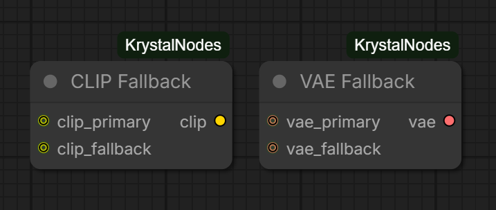
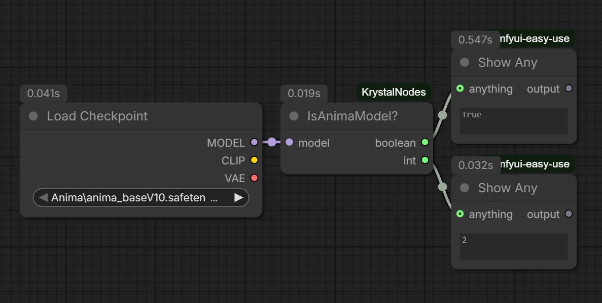

# ComfyUI-KrystalNodes

A small pack of utility nodes for ComfyUI.

## Nodes

### 🧩 CLIP Fallback
Takes two CLIP inputs and returns the first non-null one. Useful for models that don't bundle a CLIP encoder in the checkpoint, so you can have a fallback separate loader without manually switching every time.

### 🧩 VAE Fallback
Same as CLIP Fallback but for VAE. Returns the first non-null VAE input.



### 🦋 Is Anima Model?
Detects whether the loaded model is an Anima model and outputs an INT (1 for anything else, 2 for Anima) and a BOOLEAN. Wire it into a switch node to automatically route to the correct CLIP, VAE, or conditioning setup for your model.



### 🖼️ Multi Image Preview
Preview multiple images in a single node. Accepts up to any number of IMAGE inputs and displays them all. Note: due to ComfyUI's execution model, all connected inputs need to finish before the preview updates.

## Installation
Clone this repo into your `ComfyUI/custom_nodes/` folder and restart ComfyUI:
```
git clone https://github.com/Krystal-0/ComfyUI-KrystalNodes.git
```